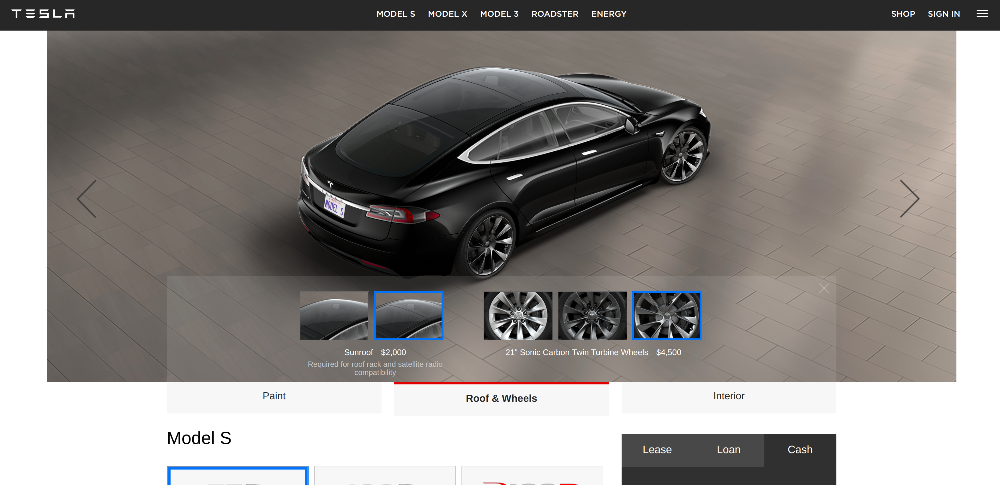

# Cars

This is the benchmark for car manufacturer's configurators. It tested:

* Aston Martin
* Ferrari
* Tesla
* Lamborghini
* Porsche
* Mercedes
*

## Aston Martin

Example on Aston Martin DB11:

[Available here](https://configurator.astonmartin.com/#/configuration/AF/AM504/QnHQIYEGBCAQIECBAgQQECBAgQIEEBAggEMEBggIIGDDCAR3cDIKjykIBCAQQMGDBiAo0wDAhHgMGBBgwQIECBAgQICEIjg=)

* ++: very detailed configurator
* ++: overview of all chosen options (with the car preview)
* ++: overview of all available options (in the top left panel)
* ++: you don't need to quit the configurator to change the model (you can switch DB11 and Vantage)
* -: car model not in 3D
* +: views are very adapted to user actions
* ++: responsive interface
* +: loading time at the beginning but not during user interaction
* --: impossible to save the model

Conclusion:

The only one preview image brings a real consistency to the interface: the options scroll but not the preview.
So that, you are not surprise and you know where to look.
Even if the point of view is not fully movable (with a 3D model) in the constant preview, you can
switch between several points of view.

The only one malus is that it seems you cannot save your configuration.

The price is never displayed. This configurator is a showcase of all available options in DB11 Aston Martin
but cannot be used to purchase the car.

## Ferrari

Example on Ferrari 812 Superfast:

[Available here](http://car-configurator.ferrari.com/812superfast?country=US&lang=EN#config/1|c0029||100b000|4003e||20100000||800|52|400|||||||||8000||2001000|4||7f804000|1ff)

* ++: very detailed configurator
* ++: progression indicator

* +: can save model
* +: can compare 2 configurations
* +/-: can see a 3D preview but not during the configuration
* -: 3D preview doesn't have 6 degrees of freedom
* -: the preview changes at each step
* +: the magnifying glass movement to catch the user look during body components configuration
* +: the summary at the end

Conclusion:

Ferrari propose a lot of nice preview settings like the sun orientation to explore light reflection or wheels in
motion. However the scrolling page discourage to try a lot of different options just to play with the configuration.
Then, your eyes need to search where to look when youswitch to a new preview.
Moreover you may sometimes don't know which piece of the car you are looking.

As the Aston Martin configurator, you cannot purchase the car and the price is not displayed.

## Tesla

Example on Tesla Model S:

[Available here](https://www.tesla.com/models/design?redirect=no)

Tesla configurator is composed of two parts:

* a aesthetic section with paint, roof, wheels or interior all in one screen with a preview
* a equipment section with the engine power, seats, autopilot, premium package, etc.

* +: the overview is simple but efficient
* +/-: all options in the equipment have a precise description
* ++: the price is indicated with several purchase options
* --: the scroll for the equipment section limits the overview of all available options and chosen ones

Conclusion:

The first section is very efficient since the overview is fixed. In the second section, Tesla made the choice
to reduce the overview capability to increase the description of each options to be very pedagogical.
This choice limits the overview of all available options and selected ones.

At the opposite of supercar configurators, Tesla configurator is not very details for aesthetic options
but I don't consider it as a constraint because it is more about a business choice and a brand strategy.
It is one of the rare car configurator to propose non aesthetic options like seats numbers or engine power.

Besides, this configurator may be used to buy the car. Option prices are displayed everywhere and you
can enter your credit card.

## Lamborghini

Example on Lamborghini Aventador:

[Available here](http://configurator.lamborghini.com/configurator/configuration/H4sIAAAAAAAAAHXNSw7CIBAG4KuYsJ7INCh1OVBoSyzESn1wFg4vUDcuTP7Ml0zmsagHdIinHjqOfS4FEYS8oLFHvvf4RiBeBs4-gZwM-G4FT78JzKI43DhJNr45lrAxzbGEOUqLJ-ZUooom3wiNIawVq3RDf5l3tnLX2dj2puFauavYMG3kqct6_vc65w8ZXkIZ3gAAAA/exterior?lang=eng&country=it)

* ++: fixed preview
* --: 3D model preview not integrated to in the configurator. And 3D preview lags.
* +: configuration may be exported with a pdf, seed
* ++: you can zoom on the preview
* +: points of view are very adapted to user actions
* +: a conclusion with a overview of chosen options
* +: the 4 parts exterior, interior, options and your car. Each one is very adapted to its content.
* +: a lot of non aesthetic options
* -: the option menu may hide the preview
* -: few options may not be visible in the preview
* --: you don't have any description or explanation for non-aesthetic options
* +: responsive

Conclusion:

Lamborghini has decided to split the configurator in 4 parts and it seems a very good idea. The 2 first ones are not scrollable and so the preview is always in the center of the screen. The 2 others ones which needed more content are scrollable.

So Lamborghini has used the better of the two worlds.

As the Aston Martin and Ferrari configurators, you cannot purchase the car and the price is not displayed. However, Lamborghini proposes to the user to defines all options even options which are not aesthetic like the fire extinguisher what seems not very understandable.

## Porsche

Example on Porsche 718 Cayman 718

[Available here](https://cc.porsche.com/icc_euro/ccCall.do?rt=1517655211&screen=1600x900&userID=FR&lang=fr&PARAM=parameter_internet_fr&ORDERTYPE=982130&MODELYEAR=2018&hookURL=https%3a%2f%2fwww.porsche.com%2ffrance%2fmodelstart%2fall%2f)

* ++: fixed preview
* ++: overview of all features
* +: price displayed for all options and the final price is also visible everytime
* +: a conclusion with a overview of chosen options
* ++: statistics like power, C02 emission, height, length are available
* ++: you can switch models directly from the configurator (and keep the selected options)
* +: you can save your configuration
* +: you can contact the porsche center
* +: you can find the options with a search bar
* +: you have a confirmation dialog on options significantly increasing the price
* --: the points of view are very limited
* ++: you can hear the sound of the engine

Conclusion:

Porsche has one of the best ergonomy as a car configurator. However the small choices of point of view
don't push you to play with the configurator. Special mention to the sound of the engine you can listen.

## Mercedes

Example on Mercedes SL 400 AMG

[Available here](https://configurator.mercedes-benz.com/configurator/gb/en/class/body/carconfig?model=2314662&nst=GB6&subprocess=CCci#paints)

* ++: 3D model preview
* --: impossible to see preview at anytime
* +/-: search bar (but not very useful to search between 5 options)
* +: a night mode to see the preview at night
* --: there is a loading time when you select an option
* +: price displayed for all options and the final price is also visible everytime
* ++: a lot of non-aesthetic options with description
* +/-: a conclusion with a very exhaustive (too exhaustive ?) description of selected options
* +: statistics about the engine power, transmission, etc in the conclusion
* --: several options have not illustration which is ugly and not understandable
* +: you can be directly connected to a retailer from the website

Conclusion:

The configurator totally uses scrolls and definitively don't push user to play with it. Otherwise the configurator
is very complete. Besides, you cannot purchase the car from the configurator but you are directly connected to a retailer

## Peugeot

Example on Peugeot 308

[Available here](http://configurer.peugeot.fr/configurer/308/5-portes/)

* ++: Virtual reality preview
* +/-: 3D model preview but only interior
* +: price displayed for all options and the final price is also visible everytime
* --: several images are not actualized according to selected options
* --: scrolling limits overview of features
* -: cannot save the configuration
* +: a lot of non-aesthetic options with detailed descriptions

Conclusion:

Peugeot has been very innovative with this configurator because it is very detailed and at the opposite of
a lot of configurator, it proposes a virtual reality preview which works quite good after tested it.
However the scrolling and the absence of feature overview limits the preview and don't push the user to
play with the configurator. 

## Toyota

https://www.toyota.fr
